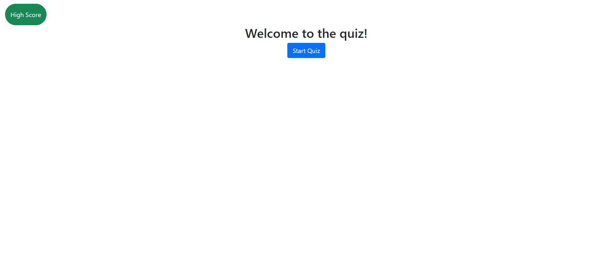
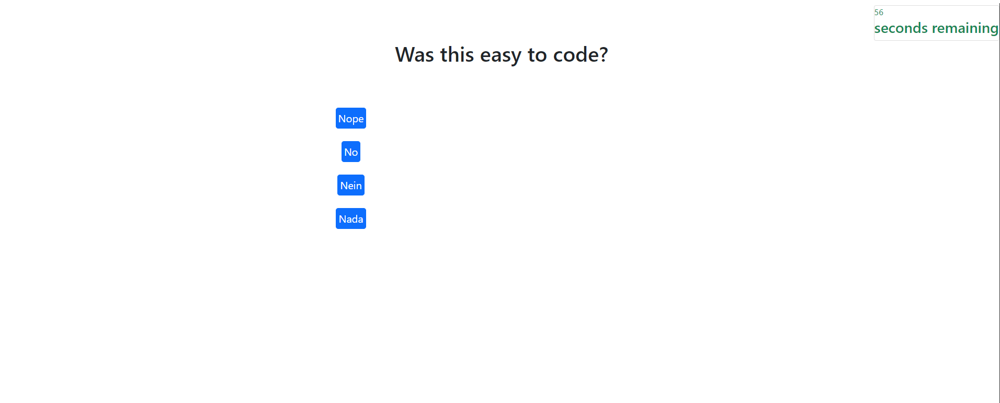

# GerrysQuiz
A simple quiz
User Story

AS A coding boot camp student
I WANT to take a timed quiz on JavaScript fundamentals that stores high scores
SO THAT I can gauge my progress compared to my peers

Acceptance Criteria
GIVEN I am taking a code quiz

WHEN I click the start button
THEN a timer starts and I am presented with a question
SO Create a timer that displays in the top right corner, that will tick down at a rate of 1 per 1000ms

WHEN I answer a question
THEN I am presented with another question
SO create using html and JS to make more questions and save the questions answer.

WHEN I answer a question incorrectly
THEN time is subtracted from the clock
SO read that the answer is incorrect and then run a function that subtracts the time.

WHEN all questions are answered or the timer reaches 0
THEN the game is over
SO when the answers are over or the timer is 0, the game ends. Saving the score.

WHEN the game is over
THEN I can save my initials and score

ADDED CRITERIA based on Mock-Up
High Score Button at the top left of screen.
The website will tell you if you got the answer correct or incorrect.
The quiz will have 4 different questions, all with different answers.

Live github pages. https://gerryraldo.github.io/GerrysQuiz/
Home page 

First Question 

